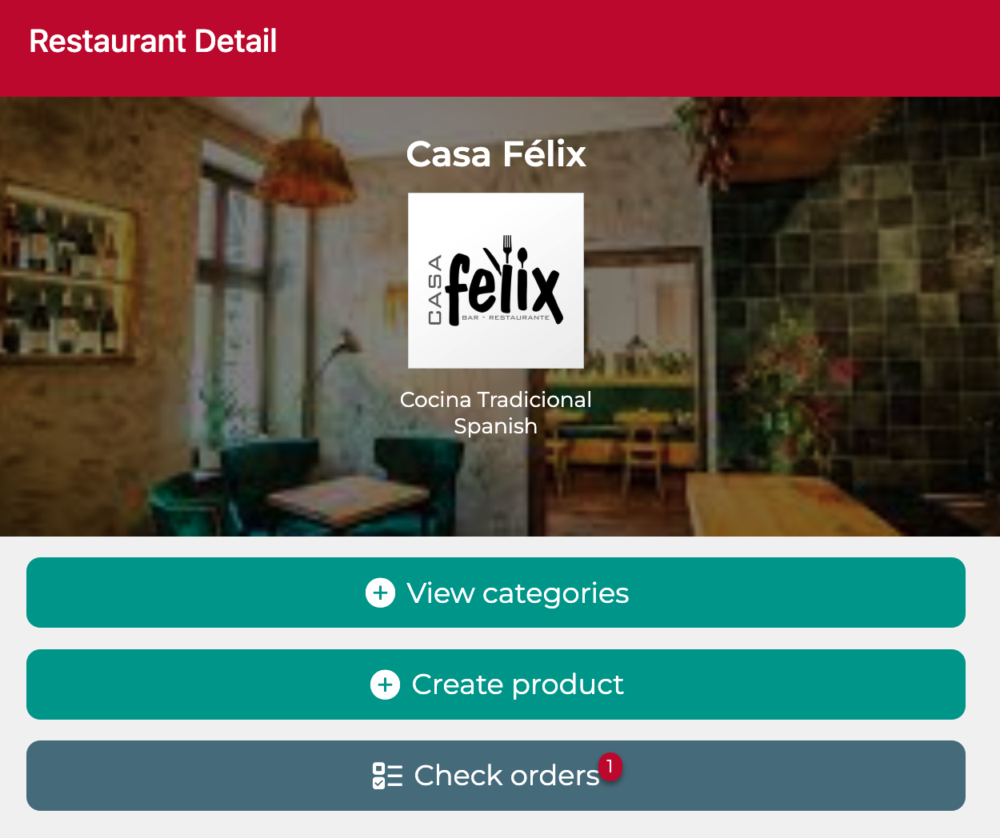
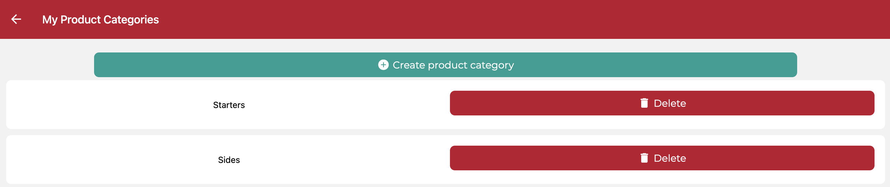
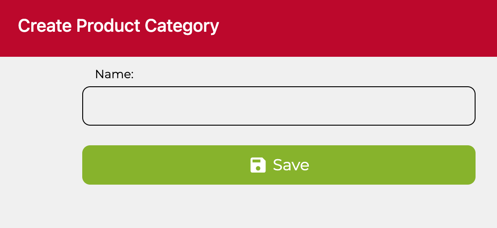

# Examen DeliverUS - Octubre 2025

Recuerde que DeliverUS está descrito en: <https://github.com/IISSI2-IS-2025>

## Enunciado del examen

Se ha de implementar la interfaz gráfica de algunos requisitos funcionales de los propietarios, en concreto:

### RF.01 – Visualización de las categorías de productos

**Como**  
propietario,

**Quiero**  
ver un listado con todas las categorías de productos asociadas al restaurante que estoy visualizando,

**Para**
poder gestionar las categorías a las que asocio los productos de dicho restaurante.

### Ejercicio 1.a (1,5 puntos)

Trabaje el RF.01 en el fichero `./src/screens/restaurants/RestaurantDetailScreen.js' realizando todos los cambios necesarios para mostrar una interfaz como se muestra en la Figura 1.



Figura 1: Botón para visualizar categorías

### Ejercicio 1.b (2,5 puntos)

Modifique el fichero `./src/screens/restaurants/ProductCategoriesScreen` realizando todos los cambios necesarios para mostrar una interfaz como se muestra en la Figura 2 (tenga en cuenta que el botón de borrado se implementará en el ejercicio 3, así que no es necesario que lo haga por el momento).



Figura 2: Listado de categorías.

---

### RF.02 – Creación de nuevas categorías de productos

**Como**  
propietario,

**Quiero**  
poder crear nuevas categorías de productos para cada uno de mis restaurantes,

**Para**  
permitir asociarlas a los productos del mismo.

### Ejercicio 2.a (2 puntos)

Trabaje el RF.02 en el fichero `./src/screens/restaurants/CreateProductCategoryScreen.js' realizando todos los cambios necesarios para mostrar una interfaz como se muestra en la Figura 3.



Figura 3: Creación de nuevas categorías de productos.

### Ejercicio 2.b (1,5 puntos)

Debe editar los ficheros `./src/screens/CreateProductScreen.js` y `./src/screens/EditProductScreen.js` para que las categorías puedan ser asignadas a los productos. Para ello, deberá modificar la vista para mostrar en el DropDownPicker de las categorías aquellas correspondientes al restaurante al que pertenece el producto.

### RF.03 – Borrado de categorías de productos

**Como**  
propietario,

**Quiero**  
poder eliminar categorías de productos existentes, siempre que no estén asociados a ningún producto,

**Para**
quitar aquellas categorías que no me son útiles.

### Pruebas de aceptación

- Al eliminar correctamente una categoría, se ha de reflejar en el listado de categorías. Además se ha de mostrar un mensaje de éxito.
- Si no se ha podido eliminar se ha de mostrar un mensaje de error.

### Ejercicio 3. (2,5 puntos)

Trabaje el RF.03 en el fichero `./src/screens/restaurants/ProductCategoriesScreen` realizando todos los cambios necesarios para borrar la categoría usando un componente _Modal_.

## Procedimiento de entrega

1. Borrar las carpetas **DeliverUS-Backend/node_modules**, **DeliverUS-Frontend-Owner/node_modules** y **DeliverUS-Frontend-Owner/.expo**.
2. Crear un ZIP que incluya todo el proyecto. **Importante: Comprueba que el ZIP no es el mismo que te has descargado e incluye tu solución**
3. Avisa al profesor antes de entregar.
4. Cuando el profesor te dé el visto bueno, puedes subir el ZIP a la plataforma de Enseñanza Virtual. **Es muy importante esperar a que la plataforma te muestre un enlace al ZIP antes de pulsar el botón de enviar**. Se recomienda descargar ese ZIP para comprobar lo que se ha subido. Un vez realizada la comprobación, puedes enviar el examen.

## Preparación del Entorno

### a) Windows

- Abre una terminal y ejecuta el siguiente comando:

  ```bash
  npm run install:all:win
  ```

### b) Linux/MacOS

- Abre una terminal y ejecuta el siguiente comando:

  ```bash
  npm run install:all:bash
  ```

## Ejecución

### Backend

- Para **recrear las migraciones y seeders**, abre una terminal y ejecuta el siguiente comando:

  ```bash
  npm run migrate:backend
  ```

- Para **iniciar el backend**, abre una terminal y ejecuta el siguiente comando:

  ```bash
  npm run start:backend
  ```

### Frontend

- Para **ejecutar la aplicación frontend del `owner`**, abre una nueva terminal y ejecuta el siguiente comando:

  ```bash
  npm run start:frontend
  ```

## Depuración

- Para **depurar el frontend**, asegúrate de que **SÍ** haya una instancia en ejecución del frontend que deseas depurar, y usa las herramientas de depuración del navegador.
